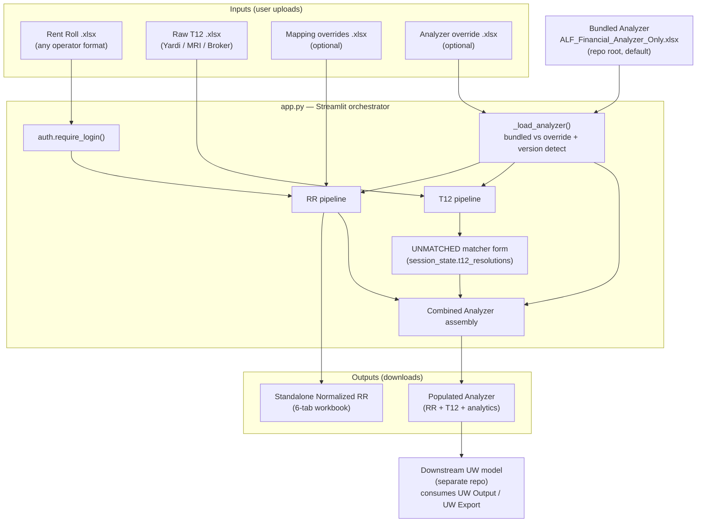
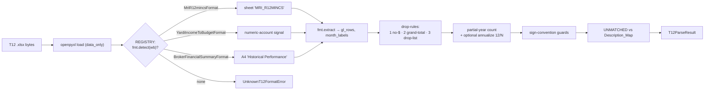
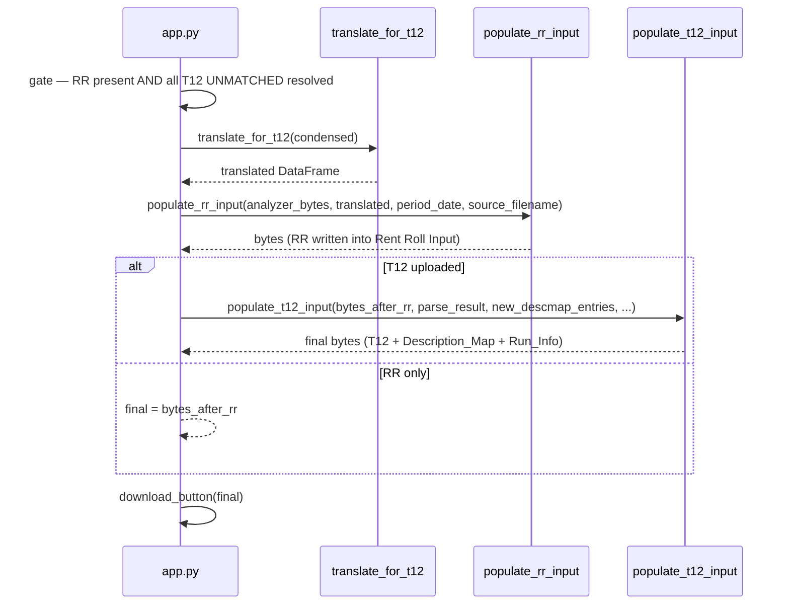
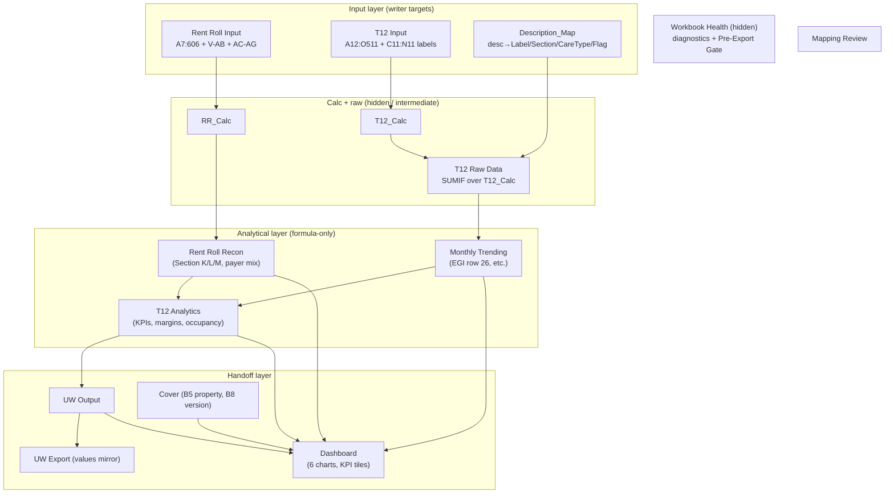
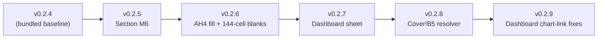

# ARCHITECTURE.md — Rent Roll + T12 Normalizer

> Complete workflow + data-flow map of the system, written for modularity:
> every module's responsibility, its public surface, the data contracts that
> cross module boundaries, and the explicit extension points. Grounded in the
> actual source (`app.py`, `normalizer.py`, `t12_normalizer.py`, the writers,
> the migration chain) as of RR v1.17.5 / T12 v0.2.1 / substrate chain through
> v0.2.9.
>
> Companion docs: `CLAUDE.md` (onboarding + history), `SPEC-RR.md` /
> `SPEC-T12.md` (per-track specs), `OPTIMIZATION-DECISIONS.md` (substrate
> decisions), `CHANGELOG-RR.md` / `CHANGELOG-T12.md`, `UW-BACKLOG.md` (forward
> work). When this file and code disagree, the code wins — update this file.

---

## 1. What the system is

A Streamlit app that ingests **any operator's** senior-housing **rent roll**
(RR) and, optionally, a **trailing-12-month financial statement** (T12), and
produces:

1. A **standalone normalized RR workbook** (6 analyst tabs), and
2. A **populated Analyzer** (`ALF_Financial_Analyzer_Only.xlsx`) — the
   underwriting substrate — with RR data in `Rent Roll Input`, T12 GL detail
   in `T12 Input`, and ~13 analytical sheets that reconcile both feeds and roll
   up to `UW Output` for handoff to a downstream full-underwriting model.

Three **tracks** share the Analyzer but are otherwise independent (see
`CLAUDE.md` → "Three workstream tracks"):

| Track | Owns | Code |
| --- | --- | --- |
| **Track 1 — RR** | rent-roll parsing → `Rent Roll Input` | `app.py`, `normalizer.py`, `mappings.py`, `pre_cleaner.py`, `period_date.py`, `reports.py`, `writer.py`, `analyzer_rr_translator.py`, `analyzer_rr_writer.py` |
| **Track 2 — T12** | T12 parsing → `T12 Input` + the Analyzer substrate | `t12_normalizer.py`, `t12_normalizer_writer.py`, `tools/migration/*` |
| **Track 3 — Analyzer** | substrate structure (sheets, formulas, charts) | workbook-only; migration scripts encode every change |

Cross-track shared utilities: `auth.py`, `property_name.py`.

---

## 2. System-level data flow



The RR pipeline is **required**; the T12 pipeline is **optional**. The
standalone RR workbook is always available; the combined Analyzer is gated on
all T12 `UNMATCHED` descriptions being resolved (see §6.3).

---

## 3. Module inventory & public contracts

Every entry lists the module's single responsibility and the **public symbols**
other modules import. Internal helpers (`_prefixed`) are omitted.

### Track 1 — RR side

| Module | Responsibility | Public API |
| --- | --- | --- |
| `app.py` | Streamlit UI + orchestration spine. Wires every other module. | *(entry point — no exports)* |
| `pre_cleaner.py` | Strip report banners / totals / blank-padding rows from raw broker rent rolls before header detection. | `clean_raw_rent_roll(df_raw) -> (df, stats)` |
| `normalizer.py` | The RR engine: header detection, parent/child bed parsing, care-bucket grouping, value normalization, concession handling. | `normalize_rent_roll(...) -> NormalizeResult`; `CONDENSED_COLUMNS`; `detect_header_row`, `detect_care_groups`, `detect_concession_cols`, `CareColGroup`, `NormalizeResult` |
| `mappings.py` | The closed vocabularies + rule engine (apt type, bed status, payer, care level, care type, care bucket). User overrides merge over defaults. | `MappingSet`, `load_mapping_workbook`, `normalize_apt/_bed_status/_payer/_care_level/_care_type`, `classify_care_bucket` |
| `period_date.py` | Derive the RR period date from the filename (fallback: today). | `detect_period_date(filename) -> date \| None` |
| `reports.py` | Build the analyst report frames from the normalized beds. | `build_summary(n)`, `build_by_type(n)`, `build_exceptions(n, unmapped)` |
| `writer.py` | Render the standalone 6-tab RR workbook with full formatting. | `write_output(condensed, normalized, mapping_audit, summary, by_type, exceptions, run_metadata) -> bytes` |
| `analyzer_rr_translator.py` | Translate Condensed_RR vocabulary → the Analyzer's data-validation vocabulary (`1BR`→`1 Bedroom`, etc.). | `translate_for_t12(condensed) -> DataFrame` |
| `analyzer_rr_writer.py` | Write the translated RR into the Analyzer's `Rent Roll Input` sheet. | `populate_rr_input(analyzer_bytes, translated_df, period_date, *, source_filename) -> bytes`; `AnalyzerRRCapacityError` |

### Track 2 — T12 side

| Module | Responsibility | Public API |
| --- | --- | --- |
| `t12_normalizer.py` | Detect T12 format, extract clean GL detail + month labels, flag UNMATCHED descriptions, sign/partial-year guards. | `parse_t12(t12_bytes, descmap_descriptions, annualize_partial_year=False) -> T12ParseResult`; `read_descmap_descriptions(wb) -> set[str]`; `GLRow`, `T12ParseResult`, `T12Format`, `REGISTRY`, `UnknownT12FormatError` |
| `t12_normalizer_writer.py` | Write parsed GL into `T12 Input`, append UNMATCHED resolutions to `Description_Map`, upsert `Run_Info`. | `populate_t12_input(analyzer_bytes, parse_result, *, new_descmap_entries, source_filename, t12_version, t12_last_updated) -> bytes`; `T12NormalizerCapacityError` |

### Track 3 — Analyzer substrate

| Artifact | Responsibility |
| --- | --- |
| `ALF_Financial_Analyzer_Only.xlsx` | The substrate. 15 sheets (see §7). Bundled at repo root; user-managed at v0.2.4 per BL-0021. |
| `tools/migration/migrate_to_v0NN.py` | One idempotent script per substrate version. Each: gate → mutate → stamp `Cover!B8` + 15 `AZ4` anchors → verify. |
| `tools/migration/v0NN_assets/` | Template-asset workbooks for migrations that insert whole sheets (e.g. Dashboard). |

### Cross-cutting

| Module | Responsibility | Public API |
| --- | --- | --- |
| `auth.py` | SHA-256 multi-user password gate; logs `[AUTH]` events to stdout. | `require_login() -> str` |
| `property_name.py` | Derive a clean property name from a filename (strip dates + report boilerplate). | `derive_property_name(filename) -> str` |

---

## 4. Data contracts (what crosses module boundaries)

These are the stable shapes modules agree on. Changing one is a cross-module
event — grep for the consumers listed.

### 4.1 `NormalizeResult` (normalizer → app → reports/writer/translator)

```python
@dataclass
class NormalizeResult:
    normalized: pd.DataFrame   # full bed-level detail (~40 cols, raw+normalized pairs)
    condensed:  pd.DataFrame   # the 30-col analyst/handoff view (CONDENSED_COLUMNS)
    mapping_audit: pd.DataFrame # Category / Source / Mapped To
    source_headers: list[str]
    header_row_idx: int
    care_groups: list[CareColGroup]
    unmapped: dict[str, list[str]]  # apt_type/bed_status/payer/care_level/care_type/missing_care_type
    property_care_type_default: str
    pre_clean_stats: dict
```

### 4.2 `CONDENSED_COLUMNS` — the RR handoff contract (30 columns)

This list is the **single source of truth** for column order. `condensed`
matches it exactly; `analyzer_rr_writer` maps it **by name** (not position)
into `Rent Roll Input`.

| Block | Cols | Added | Condensed cols |
| --- | --- | --- | --- |
| Core 18 | 1–18 | original | Unit #, Room #, Sq Ft, Care Type, Status, Apt Type, Market Rate, Actual Rate, Concession $, Concession End Date, Care Level, Care Level $, Med Mgmt $, Pharmacy $, Other LOC $, Payer Type, Move-in Date, Resident Name |
| Housing/lifecycle 7 | 19–25 | v1.16.0 | 2nd Person Rent $, Move-out Date, Balance, Notes, Market PSF, Actual PSF, ACH |
| Per-fee ancillary 5 | 26–30 | v1.17.0 (BL-0003) | Meal Plan $, Scooter Fee $, Housekeeping $, Laundry $, Pet $ |

### 4.3 `GLRow` + `T12ParseResult` (t12_normalizer → app → t12_writer)

```python
@dataclass
class GLRow:
    account: str          # "" for MRI/Broker
    description: str       # trimmed; Broker prefixes "<banner> | <desc>"
    monthly: list[float]   # EXACTLY 12, chronological, matches month_labels
    total: float           # T12 total

@dataclass
class T12ParseResult:
    gl_rows: list[GLRow]
    month_labels: list[str]    # 12 entries, "MMM YYYY" ("" pads partial-year on the LEFT)
    unmatched: list[str]       # descriptions absent from Description_Map
    format_name: str
    sheet_name: str
    sign_warnings: list[str]
    populated_months: int      # 0..12 (drives partial-year warning)
    was_annualized: bool
```

`GLRow.__post_init__` **enforces** `len(monthly) == 12` — partial-year files
are left-padded with zeros by the parser, never short.

### 4.4 UNMATCHED resolution entry (app matcher form → t12_writer)

```python
{"description": str, "label": str, "section": str, "caretype": "-"|"IL"|"AL"|"MC", "flag": str|None}
```
Appended to `Description_Map` cols A–E. The dynamic named ranges
(`DescMap_Description`, `DescMap_Label`) auto-extend via COUNTA — no formula
edits needed.

### 4.5 Analyzer sheet write-targets (the substrate contract)

| Writer | Sheet | Range written | Preserved (never touched) |
| --- | --- | --- | --- |
| `populate_rr_input` | `Rent Roll Input` | A7:S606 (data+period), V–AB, AC–AG; `A3`=property name | T–U formulas, rows 1–6, data validations on D/E/F/K/P |
| `populate_t12_input` | `T12 Input` | A12:O511 (GL), C11:N11 (month labels); `A10`=property name | col P (Coverage Check), rows 1–10, A11/B11/O11/P11 |
| `populate_t12_input` | `Description_Map` | append rows after last populated | existing rows, named ranges |
| `populate_t12_input` | `Run_Info` | create-or-append metadata | — |

**Capacity limits** (enforced; raise on exceed): RR ≤ **600** bed rows
(`AnalyzerRRCapacityError`), T12 ≤ **500** GL rows
(`T12NormalizerCapacityError`).

---

## 5. RR pipeline (detail)

```mermaid
flowchart LR
    A["RR .xlsx bytes"] --> B["pd.ExcelFile<br/>+ smart sheet pick"]
    B --> C["pre_cleaner.clean_raw_rent_roll<br/>strip banners/totals/blanks"]
    C --> D["detect_header_row<br/>(weighted token score, first 20 rows)"]
    D --> E["FIELD_PATTERNS → field_map<br/>(header → canonical field)"]
    E --> F["detect_care_groups + detect_concession_cols"]
    F --> G["row loop: classify each row<br/>parent-only / self-contained / child-bed"]
    G --> H["per-bed record<br/>normalize via mappings.py<br/>care-bucket sums, concessions, TMR"]
    H --> I["normalized DataFrame"]
    I --> J["mark shared rooms<br/>(2+ beds per Building+Room)"]
    J --> K["condensed (30 cols)"]
    K --> L["_reroute_recurring_concessions<br/>(Notes → Concession $)"]
    L --> M["NormalizeResult"]
    M --> N["reports.build_summary/by_type/exceptions"]
    M --> O["writer.write_output → standalone 6-tab"]
    M --> P["translate_for_t12 → populate_rr_input"]
```



**Row classification** (the parent/child heart of the parser):
- **parent-only** — has unit/apt id, no bed signal → refreshes apartment
  context, emits nothing (Salem-style).
- **self-contained** — has unit/apt id AND a resident name *or* recognized bed
  status → refreshes context AND emits a bed (Briar Glen single-bed,
  Homestead vacants).
- **child-bed** — has a bed signal → emits a bed using prior parent context.

**Care Type** resolves through a 6-step priority chain (explicit column →
parent context → building/wing code → care-level text → sidebar property
default → blank+flag). **Other LOC $** is the catchall for any care/ancillary
column not matched to a named bucket.

---

## 6. T12 pipeline + combined assembly

### 6.1 Parser (format-registry pattern)



Three drop-rules run inside every format's `extract()`: (1) drop rows with no
dollar value, (2) drop grand-total/subtotal/EBITDA banners, (3) drop the
explicit drop-list. Broker format additionally prefixes descriptions with their
section banner (`Direct Care | Payroll - Wages`) to disambiguate repeated line
names, and stops at `Non-Operating` / `Wages Analysis` / `Payroll Summary`.

### 6.2 Adding a T12 format = one class + one list entry

```python
class MyFormat(T12Format):
    name = "My Format"
    def detect(self, wb) -> str | None: ...     # return sheet name or None
    def extract(self, wb, sheet) -> tuple[list[GLRow], list[str]]: ...
REGISTRY = [MriR12mincsFormat(), YardiIncomeToBudgetFormat(),
            BrokerFinancialSummaryFormat(), MyFormat()]  # ← add here
```

### 6.3 Combined Analyzer assembly (the two-writer sequence)



The Analyzer's own formulas (on `T12 Raw Data`, `Monthly Trending`,
`T12 Analytics`, `Rent Roll Recon`, `UW Output`, `Dashboard`) recompute against
the freshly-written inputs when Excel opens the file — the writers only touch
input cells and the Description_Map.

---

## 7. The Analyzer substrate (Track 3)

15 sheets. Input sheets are writer targets; analytical sheets are pure formula
layers; helper sheets are hidden.



### Migration chain (how the substrate evolves)

Every structural change is an **idempotent migration script**, never a manual
edit. Pattern: gate on `Cover!B8` → mutate → stamp `Cover!B8` + every sheet's
`AZ4` anchor → verify block.



> **Bundled-file caveat (BL-0021):** the shipped `ALF_Financial_Analyzer_Only.xlsx`
> is a user-managed v0.2.4 hand-edit, *not* the output of running the chain. The
> chain (v0.2.5→v0.2.9) is preserved for reproducibility — run it forward against
> a clean workbook to reproduce the analytical sheets. See `CLAUDE.md`.

openpyxl migration gotchas live in `CLAUDE.md` → "Four openpyxl quirks that bite
migrations" (read before writing a migration).

---

## 8. Extension points (the modularity surface)

| To add… | Touch | Notes |
| --- | --- | --- |
| A **T12 format** | `t12_normalizer.py`: subclass `T12Format`, add to `REGISTRY` | §6.2. Sheet-name matchers before content scanners. |
| A **care/ancillary bucket** | `mappings.py`: `DEFAULT_CARE_BUCKETS`; `normalizer.py`: `bucket_sums` + bed record; `CONDENSED_COLUMNS`; `analyzer_rr_writer` col block; substrate column | Cross-cutting (RR + substrate). Precedent: BL-0003 per-fee split. |
| A **mapping rule** (apt/payer/etc.) | `mappings.py` default lists, OR an uploaded mapping workbook (no code) | First match wins — order specific→generic. |
| An **RR source column** | `normalizer.py`: `FIELD_PATTERNS` + bed record; `CONDENSED_COLUMNS`; `analyzer_rr_writer` mapping; substrate header | Writer maps **by name** — safe to append. |
| A **substrate change** | new `tools/migration/migrate_to_v0NN.py` + spec + changelog | Track 2/3 deliverable = script + docs, not just the workbook edit. |
| A **normalized vocabulary value** | `analyzer_rr_translator.py` map + the Analyzer's data-validation list | Keep RR vocabulary and substrate DV in sync. |
| **Persistent auth logging** | `auth.py` (BL-0019, deferred) | Currently stdout-only; see UW-BACKLOG. |

---

## 9. Invariants worth protecting

- **Writers touch input cells only.** Formulas, validations, formatting, and
  all non-target sheets are preserved. Both writers clear-then-write for
  idempotency (re-running with a different file leaves no ghost rows).
- **`CONDENSED_COLUMNS` is the column-order source of truth**; the RR writer
  maps by name, so appends are safe but renames are breaking.
- **`GLRow.monthly` is always length 12** (enforced in `__post_init__`).
- **Migrations are idempotent** and stamp `Cover!B8` + 15 `AZ4` anchors.
- **The combined download is gated** on every T12 UNMATCHED description being
  resolved; the standalone RR download never gates.
- **Substrate version on `Cover!B8`** is the canonical version; `app._detect_substrate_version`
  reads it first, then falls back to sentinel cells.
- **The live app auto-deploys from `origin/main`** (Streamlit Community Cloud).
  Reboot-first rule on divergence (see `CLAUDE.md`).
